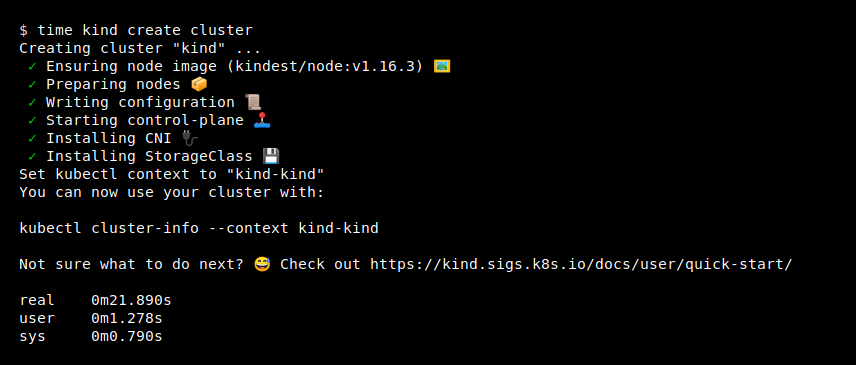

<p align="center"></p>

# Please see [Our Documentation](https://kind.sigs.k8s.io/docs/user/quick-start/) for more in-depth installation etc.

kind is a tool for running local Kubernetes clusters using Docker container "nodes".
kind was primarily designed for testing Kubernetes itself, but may be used for local development or CI.

If you have [go] 1.16+ and [docker] or [podman] installed `go install sigs.k8s.io/kind@v0.21.0 && kind create cluster` is all you need!



kind consists of:
- Go [packages][packages] implementing [cluster creation][cluster package], [image build][build package], etc.
- A command line interface ([`kind`][kind cli]) built on these packages.
- Docker [image(s)][images] written to run systemd, Kubernetes, etc.
- [`kubetest`][kubetest] integration also built on these packages (WIP)

kind bootstraps each "node" with [kubeadm][kubeadm]. For more details see [the design documentation][design doc].

**NOTE**: kind is still a work in progress, see the [1.0 roadmap].

## Installation and usage

For a complete [install guide] see [the documentation here][install guide].

You can install kind with `go install sigs.k8s.io/kind@v0.21.0`.

**NOTE**: please use the latest go to do this. KIND is developed with the latest stable go, see [`.go-version`](./.go-version) for the exact version we're using.

This will put `kind` in `$(go env GOPATH)/bin`. If you encounter the error
`kind: command not found` after installation then you may need to either add that directory to your `$PATH` as
shown [here](https://golang.org/doc/code.html#GOPATH) or do a manual installation by cloning the repo and run
`make build` from the repository.

Without installing go, kind can be built reproducibly with docker using `make build`.

Stable binaries are also available on the [releases] page. Stable releases are
generally recommended for CI usage in particular.
To install, download the binary for your platform from "Assets" and place this
into your `$PATH`:

On Linux:

```console
# For AMD64 / x86_64
[ $(uname -m) = x86_64 ] && curl -Lo ./kind https://kind.sigs.k8s.io/dl/v0.21.0/kind-$(uname)-amd64
# For ARM64
[ $(uname -m) = aarch64 ] && curl -Lo ./kind https://kind.sigs.k8s.io/dl/v0.21.0/kind-$(uname)-arm64
chmod +x ./kind
sudo mv ./kind /usr/local/bin/kind
```

On macOS via Homebrew:

```console
brew install kind
```

On macOS via MacPorts:

```console
sudo port selfupdate && sudo port install kind
```

On macOS via Bash:

```console
# For Intel Macs
[ $(uname -m) = x86_64 ] && curl -Lo ./kind https://kind.sigs.k8s.io/dl/v0.21.0/kind-darwin-amd64
# For M1 / ARM Macs
[ $(uname -m) = arm64 ] && curl -Lo ./kind https://kind.sigs.k8s.io/dl/v0.21.0/kind-darwin-arm64
chmod +x ./kind
mv ./kind /some-dir-in-your-PATH/kind
```

On Windows:

```powershell
curl.exe -Lo kind-windows-amd64.exe https://kind.sigs.k8s.io/dl/v0.21.0/kind-windows-amd64
Move-Item .\kind-windows-amd64.exe c:\some-dir-in-your-PATH\kind.exe

# OR via Chocolatey (https://chocolatey.org/packages/kind)
choco install kind
```

To use kind, you will need to [install docker].
Once you have docker running you can create a cluster with:

```console
kind create cluster
```

To delete your cluster use:

```console
kind delete cluster
```

<!--TODO(bentheelder): improve this part of the guide-->
To create a cluster from Kubernetes source:
- ensure that Kubernetes is cloned in `$(go env GOPATH)/src/k8s.io/kubernetes`
- build a node image and create a cluster with:
```console
kind build node-image
kind create cluster --image kindest/node:latest
```

Multi-node clusters and other advanced features may be configured with a config
file, for more usage see [the docs][user guide] or run `kind [command] --help`

## Community

Please reach out for bugs, feature requests, and other issues!
The maintainers of this project are reachable via:

- [Kubernetes Slack] in the [#kind] channel
- [filing an issue] against this repo
- The Kubernetes [SIG-Testing Mailing List]

Current maintainers are [@aojea] and [@BenTheElder] - feel free to
reach out if you have any questions!

Pull Requests are very welcome!
If you're planning a new feature, please file an issue to discuss first.

Check the [issue tracker] for `help wanted` issues if you're unsure where to
start, or feel free to reach out to discuss. 🙂

See also: our own [contributor guide] and the Kubernetes [community page].

## Why kind?

- kind supports multi-node (including HA) clusters
- kind supports building Kubernetes release builds from source
  - support for make / bash or docker, in addition to pre-published builds
- kind supports Linux, macOS and Windows
- kind is a [CNCF certified conformant Kubernetes installer](https://landscape.cncf.io/?selected=kind)

### Code of conduct

Participation in the Kubernetes community is governed by the [Kubernetes Code of Conduct].

<!--links-->
[go]: https://golang.org/
[go-supported]: https://golang.org/doc/devel/release.html#policy
[docker]: https://www.docker.com/
[podman]: https://podman.io/
[community page]: https://kubernetes.io/community/
[Kubernetes Code of Conduct]: code-of-conduct.md
[Go Report Card Badge]: https://goreportcard.com/badge/sigs.k8s.io/kind
[Go Report Card]: https://goreportcard.com/report/sigs.k8s.io/kind
[conformance tests]: https://github.com/kubernetes/community/blob/master/contributors/devel/sig-architecture/conformance-tests.md
[packages]: ./pkg
[cluster package]: ./pkg/cluster
[build package]: ./pkg/build
[kind cli]: ./main.go
[images]: ./images
[kubetest]: https://github.com/kubernetes/test-infra/tree/master/kubetest
[kubeadm]: https://kubernetes.io/docs/reference/setup-tools/kubeadm/kubeadm/
[design doc]: https://kind.sigs.k8s.io/docs/design/initial
[user guide]: https://kind.sigs.k8s.io/docs/user/quick-start
[SIG-Testing Mailing List]: https://groups.google.com/forum/#!forum/kubernetes-sig-testing
[issue tracker]: https://github.com/kubernetes-sigs/kind/issues
[filing an issue]: https://github.com/kubernetes-sigs/kind/issues/new
[Kubernetes Slack]: http://slack.k8s.io/
[#kind]: https://kubernetes.slack.com/messages/CEKK1KTN2/
[1.0 roadmap]: https://kind.sigs.k8s.io/docs/contributing/1.0-roadmap
[install docker]: https://docs.docker.com/install/
[@BenTheElder]: https://github.com/BenTheElder
[@munnerz]: https://github.com/munnerz
[@aojea]: https://github.com/aojea
[@amwat]: https://github.com/amwat
[contributor guide]: https://kind.sigs.k8s.io/docs/contributing/getting-started
[releases]: https://github.com/kubernetes-sigs/kind/releases
[install guide]: https://kind.sigs.k8s.io/docs/user/quick-start/#installation
[modules]: https://github.com/golang/go/wiki/Modules
